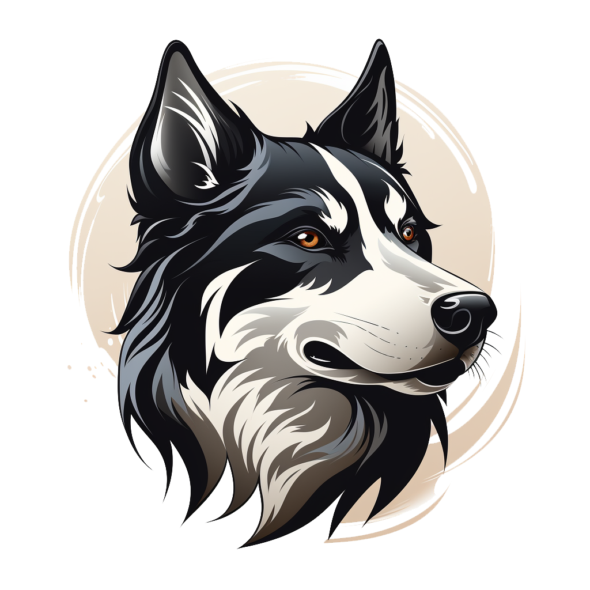

# dog_app

  

A flutter sample case-study project which uses Bloc state managment and [dog api](https://dog.ceo/dog-api/) as an API Sources

## Notes

- On the contrary of official Bloc Architecture pattern. I combined and simplified model objects on single "model" package.
- I also created a dependency injection package which depends to every layer to handle dependencies.

## Possible Improvements
- Dio package can be converted into a singleton package
- I used a simplest environment variables handling. For advanced scenerarios we would use "envied" package.
- Easy localization can be dependency inverted. I have a code generation solution for this. But I didn't apply on that project.

